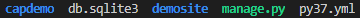
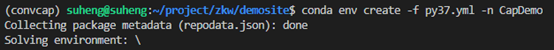
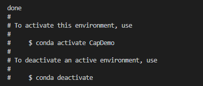
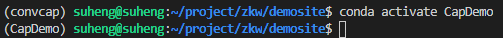
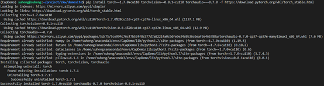
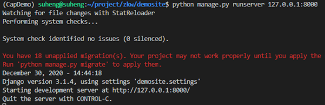
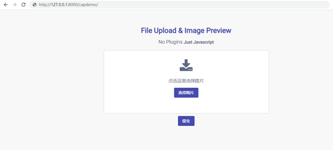
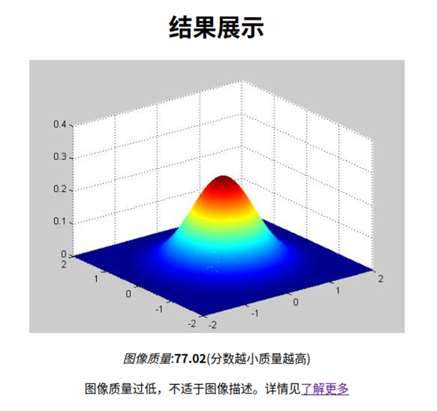

# bilingual-cap
A bilingual caption model

## 运行步骤
1. 打开终端，进入工作目录demosite，工作目录的内容如下  

2. 利用conda创建Python运行环境，输入`conda env create -f py37.yml -n CapDemo`  

3. 激活demo环境，输入`conda activate CapDemo`  

4. 安装pytorch，输入`pip install torch==1.7.0+cu110 torchvision==0.8.1+cu110 torchaudio===0.7.0 -f https://download.pytorch.org/whl/torch_stable.html`  
  
至此环境配置成功。
5. 启动服务器，输入`python manage.py runserver 127.0.0.1:8000`  
  
至此服务器启动成功。  
**注意**：第一次运行，后台会自动下载所需资源，可能会比较慢，请耐心等待。
6. 展示，打开浏览器，地址栏输入’ http://127.0.0.1:8000/capdemo/’  

---
**更新** 2021/4/10  
7. 加入图像质量评估模块，过滤掉低质量的不适于进行图像描述的图片，我们采用BRISQUE方法，详情请见”https://learnopencv.com/image-quality-assessment-brisque/”。安装”image-quality”包，输入`pip install image-quality`。  
8. 遇到非自然图像，会拒绝描述。  
  
9. 阈值可以自行修改，在文件”capdemo/views.py”的26行，我暂时把阈值设为50.0，因为”TID2008”数据集里图像的质量在0-100之间，但在实际情况中会出现大于100的情况。你们可以自行斟酌更改，值越小，过滤的图片越多。一般最小值要大于30，因为大部分自然场景的图像得分在20-30之间。
---
**更新** 2024/06/06  
10. 安装`image-quality`，输入`pip install image-quality`。如果发现再build wheel的时候失败，一般是因为conda自带的c/c++链接器与OS不兼容，删除conda环境的c/c++链接器即可，参考[unknown type [0x13] section '.relr.dyn'](https://blog.csdn.net/ONE_SIX_MIX/article/details/129983184)